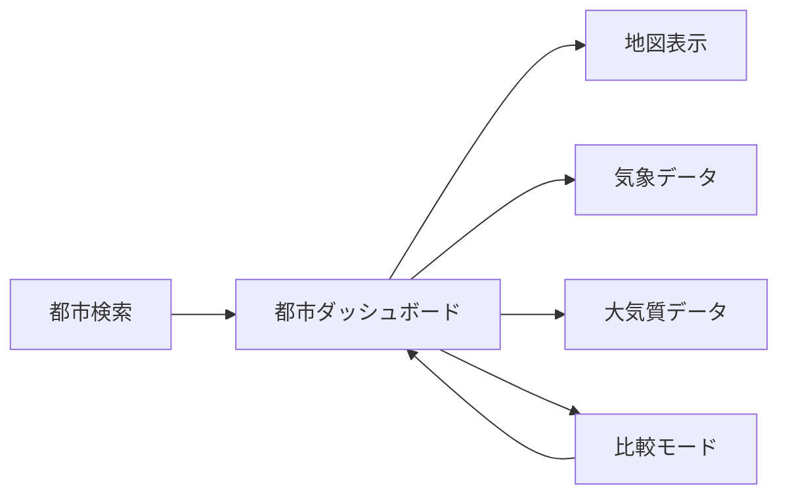
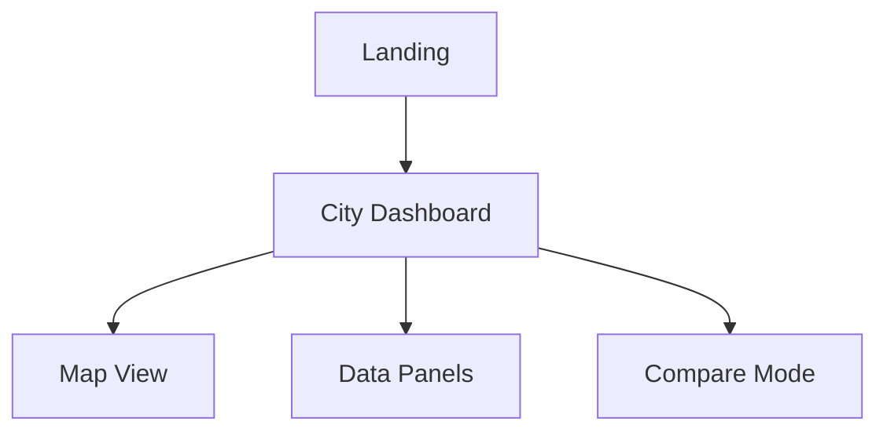
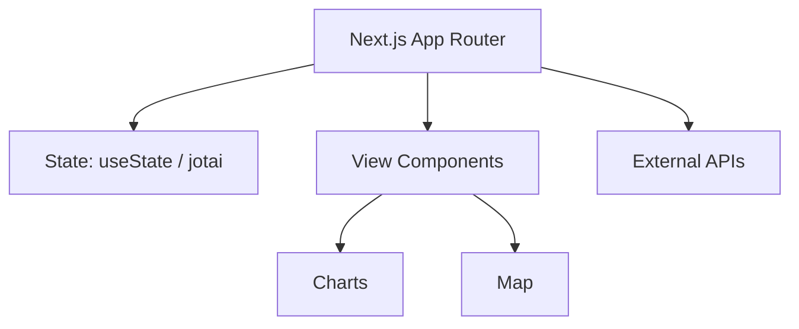

# City Observatory

都市の"いま"を観測するダッシュボード。日本地図上で天気・大気質・体感指数などを可視化し、複数都市の比較を可能にするフロントエンド専用アプリです。

## 目的

- 私自身がよく散歩をするので、天気や大気質の情報を瞬時に把握したいと思い作成しました。

## コンセプトと構成



## 主要機能

- 都市検索と候補サジェスト
- 地図のズーム・パン・レイヤー切替
- 現在値と 24h/7d（AQ は 24h/5d）の時系列表示
- 体感指数や快適度スコアの算出
- 2 都市の横並び比較

## 画面構成



## アーキテクチャ概要



## ドキュメント

- `docs/requirements.md` 要件定義
- `docs/technical-specifications.md` 技術仕様
- `docs/coding-guidelines.md` コーディング規約

## 開発フロー（Issue駆動）

- ブランチ命名: `issue-<number>-<slug>`（例: `issue-10-map-view`）
- PRタイトル: `Issue #<number>: <短いタイトル>`
- PR本文: `Closes #<number>`
- 推奨コマンド:
  - `gh issue develop <number> -b issue-<number>-<slug>`
  - `gh pr create -t "Issue #<number>: <title>" -b "Closes #<number>"`

## 開発コマンド

```bash
pnpm dev
pnpm build
pnpm start
pnpm lint
```
